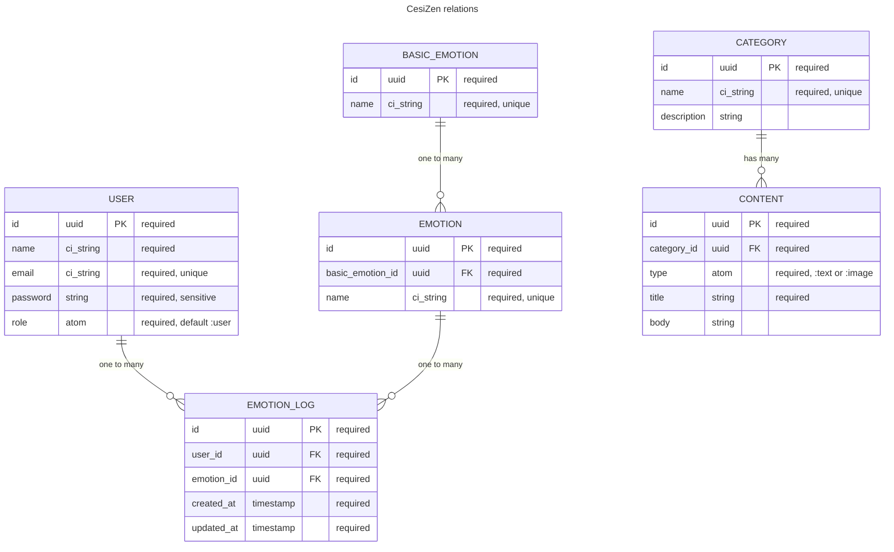

# cesizen
A minimalist application to help people be aware of their mental health.

## Development

You should have [Nix](https://nixos.org/) installed on you machine in order to build the project's
environment.

1. Clone this repository
2. run `direnv allow` to build the project's environment.

### Backend

1. Install dependencies:
    ```
    mix deps.get
    ```

2. Create and seed the database with a project's script:
    ```
    reset-db
    ```

3. From within the `./backend` directory, start the web server:
    ```
    mix phx.server
    ```

4. **Congratulations 🥳**, you can play with the application!

### Frontend

1. Install dependencies:
    ```
    cargo install dioxus-cli && npm install
    ```

2. Start the Tailwind watcher with a project's script:
    ```
    start-tailwind
    ```

3. In another terminal, from within `./frontend/cesizen-app`, start the Dioxus
   development server:
    ```
    dx serve
    ```

4. **Congratulations 🥳**, you can play with the application!

## Documentation

### Backend

#### Entity-Relationship Diagram


